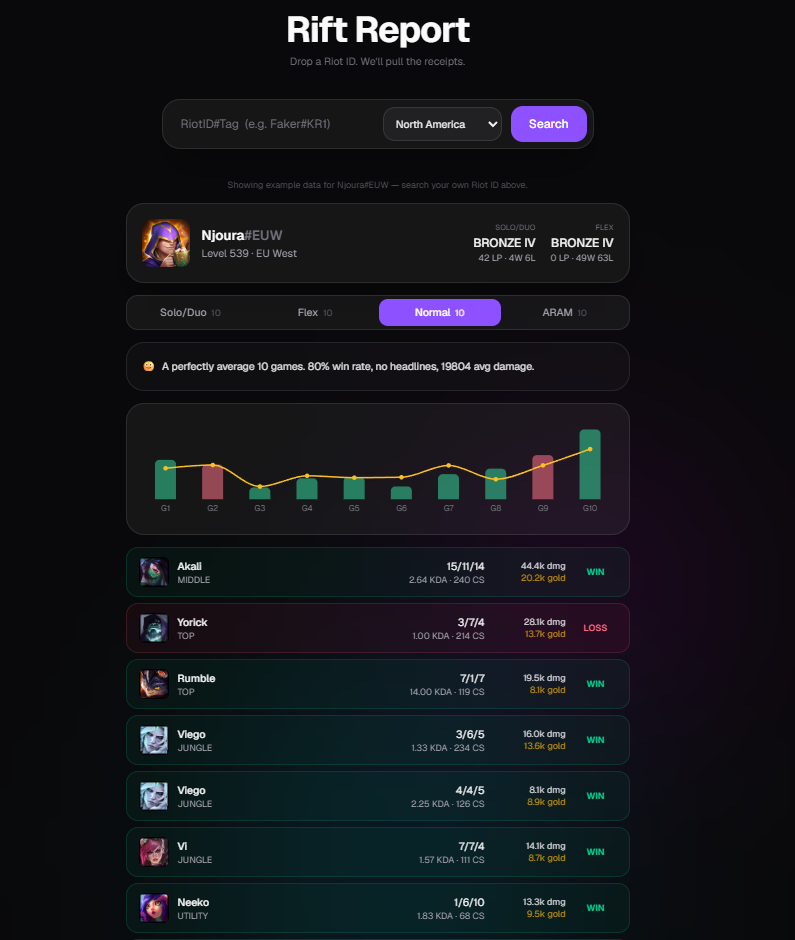

# Rift Report

Search a League of Legends Riot ID and get a per-mode breakdown of your last 10 games —
champion art, KDA, damage, gold, a small trend chart, and an opinionated comment about what
it all means ("you should play more X" / "yeah... never play X again" / "N losses in a row,
somebody tell the enemy team").

**v1.0.0** — League of Legends only scope. **Live:** https://esports-dashboard-bice.vercel.app

## Features

- Riot ID search (`gameName#tagLine` + region), Data Dragon champion/profile art
- Separate **Solo/Duo, Flex, Normal, ARAM** tabs, each with its own last-10-games view,
  independent chart, and independent roast — a losing streak in ARAM doesn't taint your
  Solo/Duo comment. Switching tabs is instant (no refetch) once a search has loaded.
- Per-game **damage dealt** and **gold earned**, plus each game's damage rank within its own
  10-player lobby (used by the roast engine to call out "bottom of the damage chart" games)
- A minimal Recharts combo chart per mode: damage bars (colored win/loss) with a gold trend
  line overlaid
- Both **Solo/Duo and Flex rank** shown on the profile card
- Rule-based roast engine (no LLM calls, so it's free and instant) that reads: current
  win/loss streak, a champion you've gone 0-for-3+ on, a champion carrying your win rate,
  one-trick detection, repeated bottom-of-lobby damage games, and falls back to a neutral
  stat summary — see [`src/lib/roast/engine.ts`](src/lib/roast/engine.ts) and
  [`lines.ts`](src/lib/roast/lines.ts) for the rule bank
- Sample data (`Njoura#EUW`) auto-loads on first visit so the page isn't empty for a
  first-time visitor; a small label makes clear it's example data until you search your own

## Stack

- Next.js App Router (TypeScript), Route Handlers as the Riot API proxy/BFF
- Postgres via [Neon](https://neon.tech), Prisma 7 (driver adapter: `@prisma/adapter-neon`)
- TanStack Query (client data fetching/loading state), Framer Motion (animations),
  Recharts (charts), sonner (toasts), Tailwind CSS
- Data Dragon CDN for champion/profile-icon images (no key required, called straight from
  the client)

## Setup

1. `npm install`
2. Copy `.env.example` to `.env.local` and fill in:
   - `RIOT_API_KEY` — from the [Riot Developer Portal](https://developer.riotgames.com/). A
     dev key expires every 24h; apply for a **Personal API key** once you're past prototyping.
   - `DATABASE_URL` — a Neon Postgres connection string (use the **pooled** connection string
     from your Neon project dashboard).
3. Push the schema to your database: `npx prisma db push`
4. `npm run dev` and open the printed local URL.

Dev/build scripts run webpack (`--webpack`) instead of Turbopack — on Windows, Turbopack's
node_modules junction-point caching can fail without Developer Mode / elevated permissions.
Vercel's Linux build environment isn't affected; drop the flag there if you want Turbopack.

## Data model / caching

Riot match data is immutable once a game ends, so `MatchRecord` rows are a permanent cache —
a given match is only ever fetched from Riot once, no matter how many times it's viewed or
how many players in it get searched. `Account` rows (profile + both ranks) refresh every 10
minutes. Each search fetches one match-ID list per mode from Riot (filtered server-side via
the `queue` param) in parallel, unions them, and only fetches match detail + writes cache
rows for IDs genuinely missing — a repeat search of an already-cached player does zero Riot
calls and responds in well under a second. See
[`prisma/schema.prisma`](prisma/schema.prisma) and
[`src/lib/riot/service.ts`](src/lib/riot/service.ts).

## Compliance

Per Riot's Developer Policies, the app displays the required "not endorsed by Riot Games"
notice in the footer ([`src/components/footer.tsx`](src/components/footer.tsx)).

**Before sharing the live link publicly, two things Riot's policy requires that aren't a
code change:**

1. **Register the product** on the [Riot Developer Portal](https://developer.riotgames.com/) —
   required "if your product serves players, regardless of whether it uses official
   documented APIs." Personal projects can register without the full verification process.
2. **Get the right API key for the traffic.** A dev key expires every 24h and is not for
   public consumption at all (not even an open beta). A **Personal key** (20 req/s, 100
   req/2min) is meant for personal/small-private-community use, not necessarily for
   "post the link anywhere" traffic. If this gets real public usage, apply for a
   **Production key** through the registered product above.

Until a Production key is in place, keep the audience small — the personal-key rate limit is
shared across every visitor's searches, and Riot can revoke a key that's clearly serving
public traffic under the wrong tier.

## License

[MIT](LICENSE) for this project's own code. Riot Games' data, assets, and trademarks are not
covered by that license and remain governed by
[Riot's Developer Policies](https://developer.riotgames.com/policies/general) — this project
is not endorsed by or affiliated with Riot Games.

## Deploy

Designed for Vercel: connect the repo, set `RIOT_API_KEY` and `DATABASE_URL` as environment
variables, deploy. No Docker needed — Neon is already a managed/serverless Postgres and Vercel
builds Next.js natively.

### Gotchas hit getting this running on Vercel (so you don't have to rediscover them)

- **Prisma 7 dropped automatic `.env` loading from the CLI.** `prisma.config.ts` has to load
  env files itself (`@next/env`'s `loadEnvConfig`) before reading `DATABASE_URL` — the CLI no
  longer does this for you like older Prisma versions did.
- **`prisma generate` needs a `postinstall` hook** or Vercel's `@prisma/client` package stays
  an empty stub and every import of it fails to typecheck. `"postinstall": "prisma generate"`
  in `package.json`.
- **Vercel's "Sensitive" environment variables are withheld from the build step on purpose**
  (they're only injected at runtime, to reduce what could leak into build logs). Anything that
  constructs a `PrismaClient` at module-import time will crash `next build`'s page-data
  collection, even though the var is genuinely configured — construct it lazily instead, on
  first real request (see [`src/lib/db/prisma.ts`](src/lib/db/prisma.ts)).
- **When connecting a Storage integration (e.g. Neon) via the Vercel dashboard, leave the
  "Environment Variable Prefix" field blank.** Typing anything in there (even the name of the
  variable you think you're setting) prepends that text to every generated variable name —
  e.g. the real connection string ends up in `DATABASE_URL_DATABASE_URL` instead of
  `DATABASE_URL`, and a separately/manually-added plain `DATABASE_URL` silently points at
  nothing.
